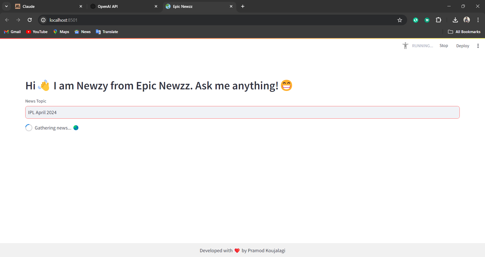
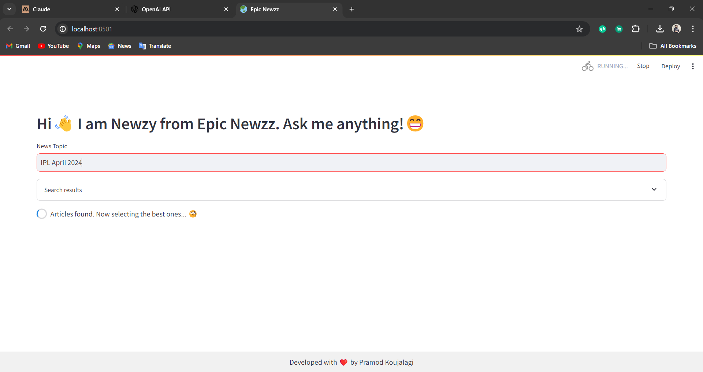
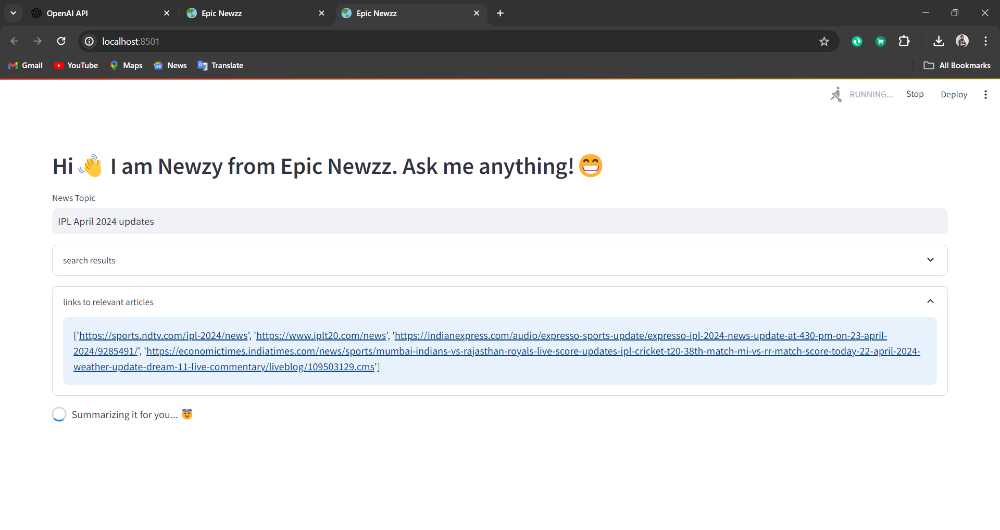
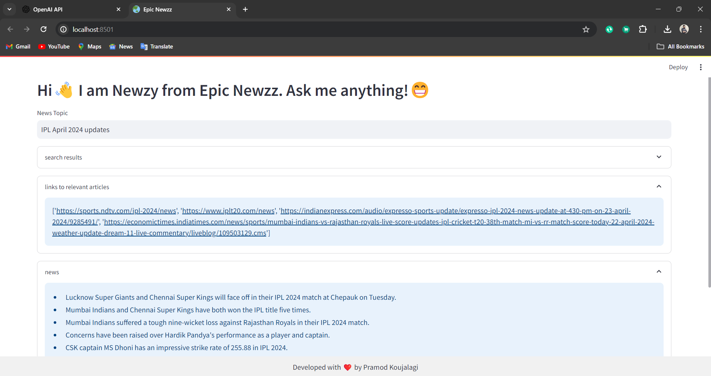
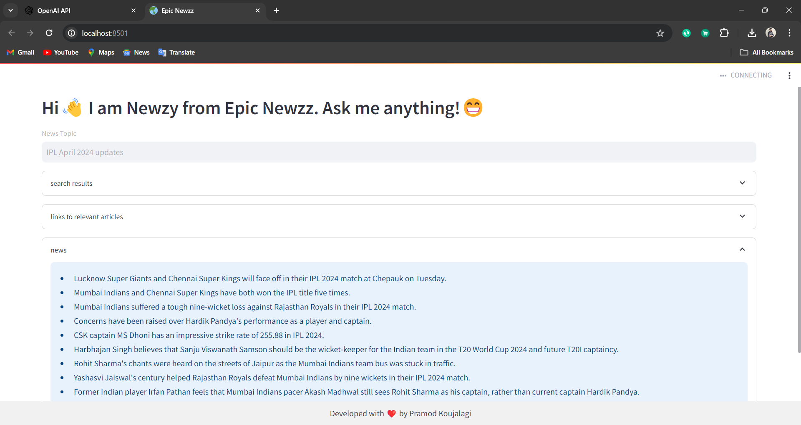
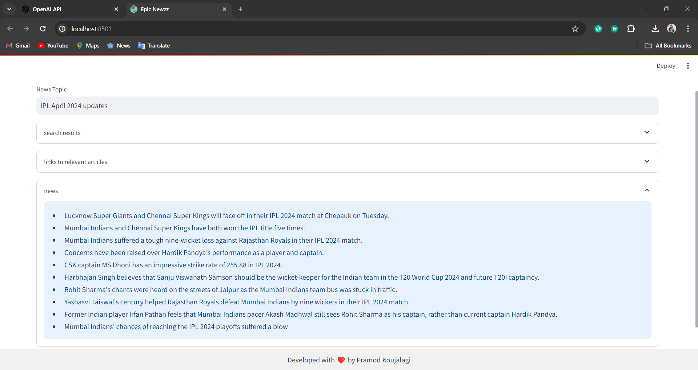
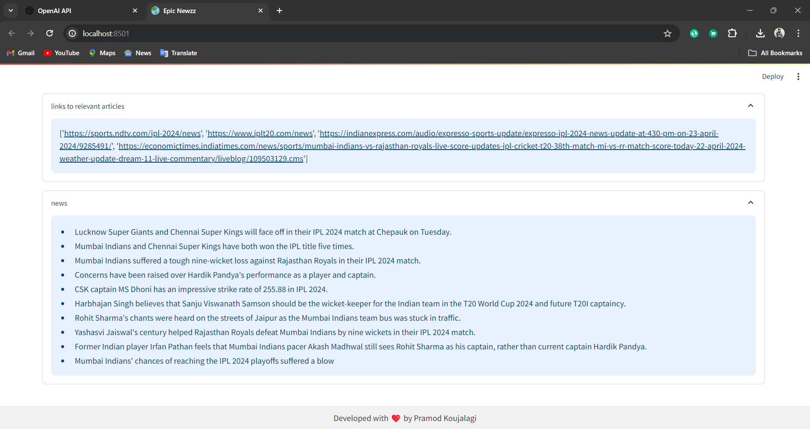
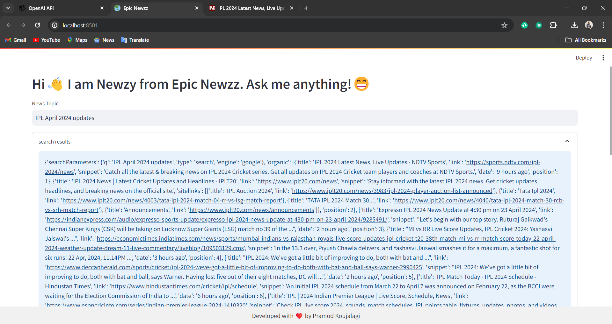

<h1 align="center">Epic Newzz by Pramod 🚀📰</h1>

<p align="center">
Newzy says - Stay informed, Stay Ahead!
</p>

## Introductio

Epic Newzz is not just another news aggregator. It's your personalized news concierge, delivering curated updates tailored to your interests and preferences. Powered by cutting-edge AI technologies, Epic Newzz transforms the way you consume news, making it more engaging, informative, and effortless.

## 🤖 Meet Newzy - Your AI News Companion

Newzy, your AI news companion, is the brain behind Epic Newzz! Armed with state-of-the-art Large Language Model (GPT-3.5 Turbo) and intelligent algorithms, Newzy scours the web, curates the most relevant news articles, and provides insightful summaries tailored just for you. With Newzy by your side, stay ahead of the curve and never miss a beat in the fast-paced world of news.


<p align="center">
  
  
  
  
  
  
</p>

## 🌟 Features

- **Dynamic News Gathering**: Instantly access the latest news updates on any topic of interest.
- **Intelligent Summarization**: Dive deep into comprehensive news summaries for quick insights.
- **Personalized Experience**: Tailor your news feed to match your preferences and interests.
- **Sleek and Intuitive Interface**: Navigate seamlessly through an elegant and user-friendly design.


## 📸 Image Gallery

<p align="center">
  
  
  
  
  
  
  
  
  
</p>

<!--
## 🚀 Getting Started

1. **Clone the Repository**: Get started by cloning the Epic Newzz! repository to your local machine:

   ```bash
   git clone https://github.com/pramodkoujalagi/AI-News-Agent.git
   ```


2. **Set Up Environment Variables**: Create a `.env` file and add your OpenAI and SerpAPI API keys:

    ```bash
    OPENAI_API_KEY=your_openai_api_key
    SERPAPI_API_KEY='your_serpapi_api_key'
    ```

3. **Run the Application**: Launch the Epic Newzz! application to start exploring the latest news:

   ```bash
   streamlit run app.py
   ```
-->
## 📝 Functionality

The code behind Epic Newzz leverages the power of Large Language Models (GPT-3.5 Turbo) and intelligent algorithms to gather, curate, and summarize news articles from across the web. Newzy, the AI news companion, interacts with users through the Streamlit interface, enabling seamless navigation and personalized news experiences. From dynamic news gathering to intelligent summarization, Epic Newzz delivers an unparalleled news consumption experience like never before.

## 🤝 Contributing

Epic Newzz welcomes contributions from the community. Feel free to fork the repository, make improvements, and submit pull requests to enhance the news experience for all users.

## 👨‍💻 About the Developer

Newzy - AI News Companion is developed and maintained by [Pramod Koujalagi](https://github.com/pramodkoujalagi)

Connect with me to share feedback, suggestions, and ideas for future enhancements.

Ready to elevate your news experience? Dive into Epic Newzz and discover a world of curated content at your fingertips! 🌍✨

## ⚖️ License
This project is licensed under the MIT License - see the [LICENSE](LICENSE) file for details.
